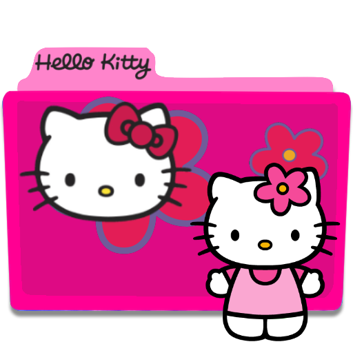

# Oi, aqui é a Ingrid! 👋

Desenvolvedora brasileira com foco, no futuro, **desenvolvimento de jogos** para entretenimento e educação.  
Sou formada em Análise e Desenvolvimento de Sistemas com especialização em Engenharia da Computação.  
Atualmente estou cursando Jogos Digitais!

Atuando como analista e estudando o desenvolvimento de ERP!

→ Meus repositórios contêm projetos acadêmicos, estudos de tecnologias e pesquisas pessoais.  
Sinta-se livre para explorar, aprender e contribuir! 🚀

## 💡 Tecnologias Principais

### Linguagens
→ Python  
→ Javascript  
→ C#  
→ Visual Basic

### Frameworks
→ Tailwind  
→ React  
→ Flutter
